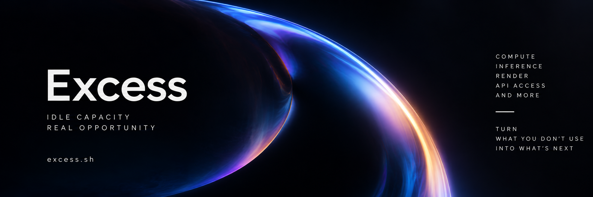

# Excess Worker

Run selected AI models on your computer and supply inference capacity through [Excess](https://excess.sh), with local controls over when and how your machine works.

**Excess Worker 0.2.0 (sequence 26) · [Windows x64 download](https://github.com/excesssh/Excess-Worker/releases/download/v0.2.0/excess-worker-0.2.0-8724162f793d-win-x64.zip) · [Linux x64 download](https://github.com/excesssh/Excess-Worker/releases/download/v0.2.0/excess-worker-0.2.0-8724162f793d-linux-x64.tar.gz)**

The published [0.1.0 release](https://github.com/excesssh/Excess-Worker/releases/tag/v0.1.0), its anonymous project key and its evidence remain unchanged and available as historical release records.

**[Verify your download →](docs/VERIFICATION.md#verify-your-download)** Establish the trusted project key, verify the release signature, then check your archive before installing. [0.2.0 release files](https://github.com/excesssh/Excess-Worker/releases/tag/v0.2.0) · [Installation guide](docs/INSTALLATION.md)

## Trust and machine protection

- **Public source.** Inspect the worker and build it yourself. [Source and build instructions](docs/BUILD.md).
- **Project-signed downloads.** Minisign authenticates the release manifest; its signed hashes identify the exact archives. [Key and verification commands](docs/VERIFICATION.md#verify-your-download).
- **Reproducible packages.** The two independent sequence-26 builds produced identical Windows and Linux packages. This covers assembled packages, not independent rebuilds of upstream binaries, operating systems or drivers. The published [0.1.0 comparison report](https://github.com/excesssh/Excess-Worker/releases/download/v0.1.0/reproducibility.json) applies only to that earlier package. [Build scope](docs/BUILD.md#reproducibility-and-release-status) · [sequence-26 comparison report](https://github.com/excesssh/Excess-Worker/releases/download/v0.2.0/reproducibility.json).
- **Scoped machine credentials.** A revocable device key signs worker messages. It cannot authorize wallet spending or withdrawals, and the model runtime never receives it. [Credential handling](SECURITY.md#sensitive-local-data).
- **Restricted model access.** Selected model/runtime files are read-only, scratch is private, and direct network access is denied. Downloads require explicit model/runtime and licence consent. [Security boundaries](SECURITY.md#model-runtime-boundaries) · [model consent](docs/MODELS.md).
- **Control and authenticated updates.** Set resource limits, drain or stop work, and revoke a device. The published 0.1.0 release passed its update and recovery checks. Sequence-26 Linux direct installation and update/recovery passed; Windows direct installation, authenticated update, and CPU/CUDA recovery passed. Candidate25 buyer jobs are separately identified, with sequence-26 execution payload matches recorded. [Supplier controls](docs/OPERATIONS.md#local-controls) · [update and recovery evidence](docs/VERIFICATION.md#updates-and-recovery).

A valid signature establishes that the release was signed by the holder of the trusted **project key**, and that its authenticated contents have not changed. It does not establish a verified legal publisher, an independent security audit or guaranteed safety. Windows executables have **no trusted Authenticode publisher signature**; read the [Windows warning guidance](docs/INSTALLATION.md#windows-publisher-warnings) before running them.

## Start supplying

1. **Download.** Choose the platform archive plus `release.json` and `release.json.minisig` from its [release page](https://github.com/excesssh/Excess-Worker/releases/tag/v0.2.0). Packages include Node; suppliers do not need npm or a source build.
2. **Verify.** Follow [Verify your download](docs/VERIFICATION.md#verify-your-download), including establishing the trusted key. The website's file checker compares hashes; it does **not** verify a release signature.
3. **Install.** Use the [verified offline installer commands](docs/INSTALLATION.md#install-the-verified-package) as your ordinary user. Add the installed launcher to your session's PATH, then run `excess-worker guide` and `excess-worker doctor`.
4. **Pair.** Run `excess-worker pair https://excess.sh "my-worker"`. On the [Supply page](https://excess.sh/supply), sign in, choose **Add a machine**, then **Next: pair your machine**. Enter the CLI code and compare the fingerprint; approve only if they match, then return to the CLI and run `excess-worker complete-pairing`. Wallet approvals happen on the website.
5. **Choose a model.** Run `excess-worker models`, select `excess-worker use qwen3-4b --cpu`, then review `excess-worker model-plan`. Read the listed licences and download sizes before [accepting the model/runtime installation](docs/INSTALLATION.md#choose-and-install-a-model).
6. **Supply capacity.** Set your resource policy and supplier price, then start work: `excess-worker run` on Windows, or the bounded user service on Linux. [Exact commands and price units](docs/INSTALLATION.md#supply-capacity). Check progress and earnings on the Supply page. Availability does not guarantee demand or earnings.

## Models you can choose

The local catalogue has **13 text models and four media models**, with pinned files and licences.

| Task | Available catalogue entries |
| --- | --- |
| Text | Qwen3 4B, 8B, 14B, 30B-A3B, 32B, Coder 30B-A3B and Instruct 2507; Phi-4 mini and Phi-4; Llama 3.1 8B and Llama 3.3 70B; gpt-oss 20B and 120B. |
| Embeddings | Qwen3 Embedding 0.6B. |
| Transcription | Qwen3 ASR 0.6B. |
| Images | SD-Turbo and FLUX.1 schnell. |

**[Complete catalogue: sizes, memory, quantization, licences and installation steps](docs/MODEL-CATALOG.md)** Run `excess-worker models` to see every local entry and its estimated fit. As of 7 October 2026, the source catalogue contains 43 hosted-provider entries as a separate service; they cannot be installed on a worker. This count can change independently of the 17 pinned local models.

Catalogue availability is broader than verified execution. This table separates signed candidate25 buyer evidence, the sequence-26 payload-equivalence check, completed sequence-26 installation and lifecycle checks, and historical published 0.1.0 evidence. Candidate25 execution evidence applies only to the matching executable, native, dependency, launcher and licence payloads.

Published 0.2.0 also passed [Qwen3-8B](docs/verification/qwen3-8b-windows-cpu.md) and [Qwen3-14B](docs/verification/qwen3-14b-windows-cpu.md) Windows CPU buyer lifecycles, including useful signed output, cancellation, settlement and cleanup. Both CUDA routes remain unverified. Published sequence 26 additionally passed [Phi-4-mini Windows CPU and CUDA buyer lifecycles](docs/verification/phi4mini-windows.md) on the recorded RTX 3070 Ti.

## Your machine, your controls

Choose the model, price, CPU threads, memory budget and operating schedule. Battery pauses and temperature limits depend on available telemetry. Windows CUDA has a separate sampled GPU memory watchdog; it is not a hard VRAM reservation or hardware partition. Use `excess-worker drain` to finish the current attempt without taking new work, or `excess-worker stop-now` to request immediate shutdown. Revoke a device on the Supply page to remove its coordinator access. [Controls, stopping and revocation](docs/OPERATIONS.md).

| Configuration | Candidate execution evidence and sequence-26 payload check | Published 0.1.0 historical evidence |
| --- | --- | --- |
| Windows x64 CPU | Qwen3-4B, Qwen3 Embedding 0.6B, Qwen3 ASR 0.6B and SD-Turbo buyer routes passed. Published sequence 26 additionally passed Qwen3-8B at two threads/10 GiB and Qwen3-14B at two threads/11 GiB, plus Phi-4-mini at two threads/8 GiB. | Qwen3-4B on the recorded Windows 11 workstation. |
| Windows x64 NVIDIA CUDA | The same four model/task routes passed on the recorded RTX 3070 Ti, driver 596.49. Published sequence 26 additionally passed Phi-4-mini with two threads, 8 GiB host and 6 GiB CUDA budgets. | Qwen3-4B with separate 6 GiB host and GPU budgets. |
| Linux x64 CPU | Qwen3-4B buyer job passed on signed sequence 25 in WSL2 (Linux 6.18.40.1, 2 threads, 8 GiB memory, zero swap, 64 tasks, CPU 200%). The sequence-26 build report matches its execution payload fingerprints; sequence-26 direct installation and CPU recovery also passed. | Qwen3-4B on WSL2 with the bounded systemd user service. |
| Linux GPU | Candidate-unverified; no Linux GPU support claim. | Not supported in 0.1.0; that release refuses execution. |

The release reuses candidate25 buyer execution through verified unchanged executable payloads. It passes fresh installation, authenticated update and actual CPU/CUDA recovery on Windows, plus fresh installation, update and CPU recovery on the recorded Linux WSL2 configuration. The original intermittent CUDA incident's cause remains unestablished; the separate native admission fix and five successful repeat jobs are scoped evidence. [Execution and release evidence](docs/VERIFICATION.md#candidate25-execution-evidence) · [Remaining model coverage](docs/verification/remaining-work-checklist.md).

## For developers

The standalone npm workspace contains the worker, adapters and protocol. Coordinator services, custody and settlement signing are maintained separately.

Use Node **24.11.1**, npm **11.7.0** and the committed lockfile. Use `npm.cmd` in Windows PowerShell.

```sh
npm ci --ignore-scripts
npm run build
npm test
```

[Build and packaging](docs/BUILD.md) · [Architecture](docs/ARCHITECTURE.md) · [Contributing](CONTRIBUTING.md) · [Source history](docs/HISTORY.md) · [MIT licence](LICENSE)

Found a security issue? Use [GitHub private vulnerability reporting](https://github.com/excesssh/Excess-Worker/security/advisories/new). Keep exploitable details out of public issues. [Security policy](SECURITY.md#reporting).
